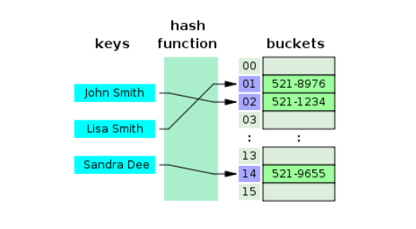

해시테이블과 해시맵의 차이를 알아보기 전, 어떤 것 인지부터 알아보도록 하겠습니다. 
> 해시테이블(Hash Table)

1. 키(key)와 값 (value)이 하나의 쌍으로 이루어진 데이터 구조입니다. 
2. 해시테이블은 내부적으로 배열(버킷)을 사용하여 키를 인덱스값으로 놓고 배열(버킷)에 값을 저장하는 형태입니다.   

{: width="800" height="200}{: .center}

3. key와 value가 put()메서드로 저장될때,    
    key값에 해시함수를 적용해 배열의 index를 생성해냅니다. 
   and 그 index스에 해당 value가 저장되는것이죠.   
   이 때, 실제 값이 저장되는 배열을 버킷 or 슬롯이라 합니다.   
   
> 해시함수는?
고유한 인덱스 값을 생성하는 메서드입니다.   

대표적인 해시 함수
-> 1. Division Method: 주소=입력값 % 테이블 크기   
테이블의 크기를 소수로 정해 2의 제곱수와 먼 값을 사용하는 것이 좋다.
-> 2. Digit Folding : 
각 Key 의 문자열을 아스키 코드로 바꾸고, 값을 합한 데이터를 데이터 내의 주소로 사용하는 방법
-> 3. Multiplication Method: 숫자로 된 Key값 -> k , 0과 1사이의 실수 -> A, 2의 제곱수 -> 을 이용하여
 h(k) = (kAmod1) x m 계산을 해준다. 
-> 4. Univeral Hashing : 다수의 해시함수를 만들어 집합 H에 넣어두고,
 무작위로 해시함수를 선택해 해시값을 만드는 기법

> 해시값이 충돌하는 경우

"nageom" 을 해시 함수를 돌아나온 해시값이 "dawon"의 해시함수를 돌려 나온 값과 동일하는 경우를
충돌한다 말한다.    
이러한 충돌을 해결하는 방법은 크게 두 가지가 있다. 
<분리 연결법(Separate Chaining)>
{: width="800" height="200}{: .center}

분리 연결법 (Separate Chaining) 위의 그림처럼 해시값이 충돌할 경우 추가 메모리를 사용하여 다음 데이터의 주소를 저장
하는 것이다. 위의 그림처럼 

References     
https://hee96-story.tistory.com/48      
https://mangkyu.tistory.com/102

