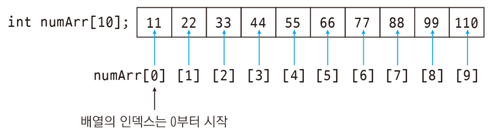
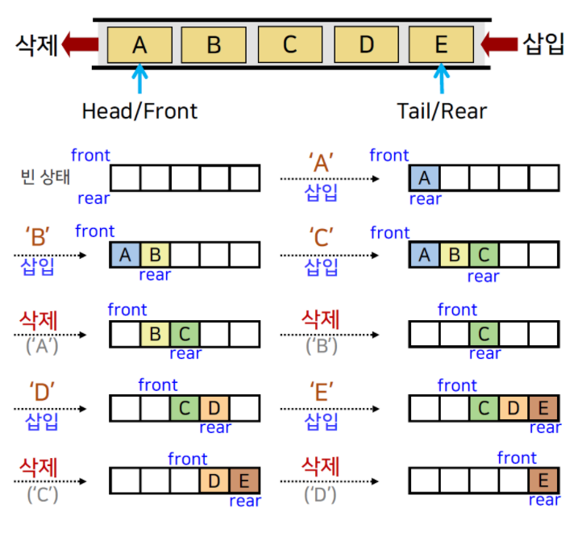
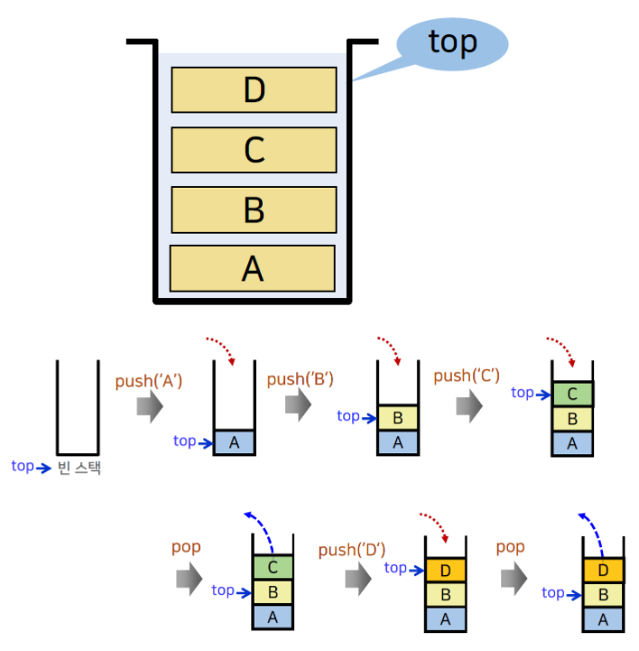
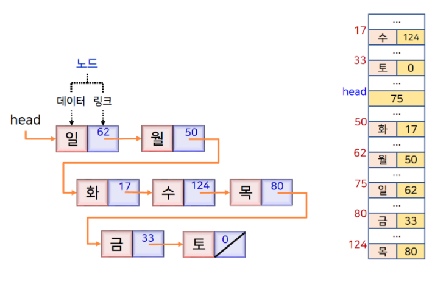
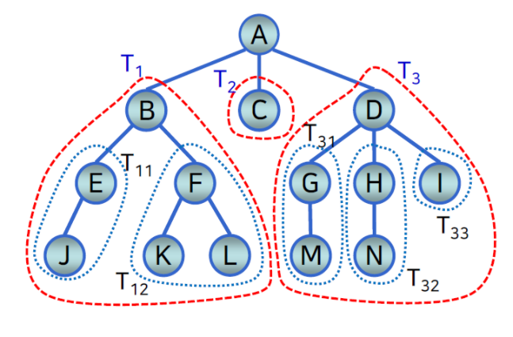
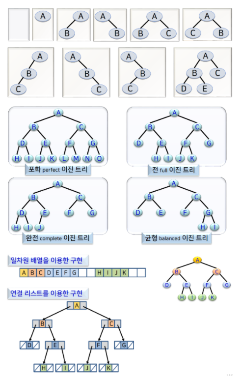
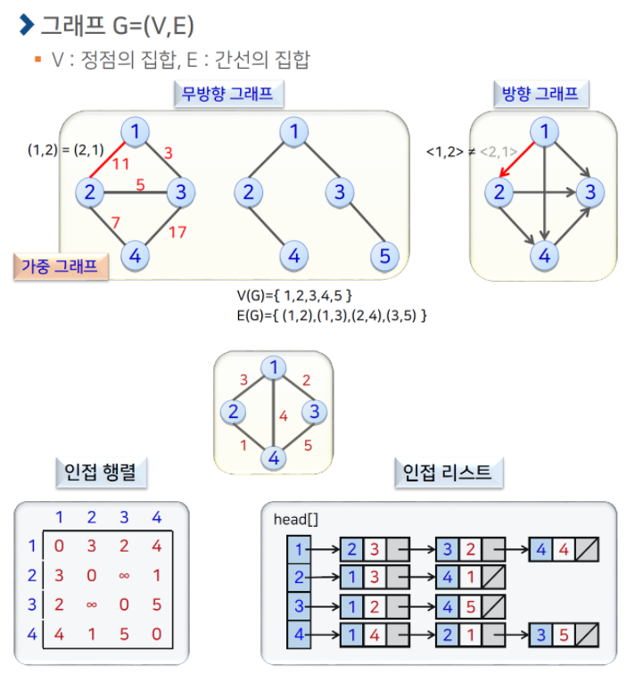

* * * 
오늘의 주제는 알고리즘과 자료구조의 차이입니다.   
카테고리를 정하려다보니까 궁금해지더라고요. 한번 볼까요?   
  

자료구조와 알고리즘의 차이를 설명할때 가장 많이 나오는 예시가 도서관이더라구요.    
자료구조는 '책장에 꽂혀있는 책들의 정리*방법*' -> ex) 알파벳순, 연도순 등   
알고리즘은 '책장에서 책을 찾는 절차' -> ex) 위에서 아래, 왼쪽에서 오른쪽 또는 무작위 등
> 자료구조 + 알고리즘 = 프로그램

 
자료구조는 데이터에 편하게 접근,변경하기 위한 데이터의 저장&조직하는 방법을 말하는 것 입니다. 
그래서 모든 목적에 맞는 자료구조는 없다 -> 각 자료구조가 갖는 장점과 단점을 잘 아는 것이 중요하죠.   

자료구조의 간단 설명!    
1.배열 (Array)   
{: width="800" height="200}{: .center}
 
2.큐 (Queue)   

참고 그림처럼 마치 다 쓴 두루마리 휴지심처럼 입구와 출구가 두 개 있는 구조.   
입구의 주소를 rear로 명시, 출구의 주소를 제일 처음들어온 친구의 주고 front로 명시해두어서   
데이터를 넣을때는 rear뒤로, 삭제 시에는 front에 있는 데이터를 삭제하고 front는 다음 주소로 
이동합니다. --> 기억을 더듬으며 적은거라 수정 요망!! :)
FIFO(First In First Out)

3.스택 (Stack)

입/출구가 하나뿐이라 마지막에 넣은 반찬이 제일 위에 있어서 먼저 꺼내먹을 수 밖에 없는 구조.    
LIFO(Last In First Out)   

4.연결 리스트(Linked List)

한 클래스가 데이터와 링크를 멤버로 갖고있는것입니다   
그래서 클1, 클2, 클3 이렇게 차례로 연결 되어있다면   
클1("데이터1", head의 주소), 클2("데이터2", 클1의 주소), 클3("데이터3", 클2의주소)...   
이렇게 자기 앞에 주소를 갖고 찾아가는식으로 연결연결 되어있는 자료구조입니다. 
- 단일 연결 리스트, 단일 원형 연결 리스트, 이중 연결 리스트, 이중 원형 연결 리스트가 있습니다.

5.트리 (Tree)

6.그래프 (graph)

관계를 그래프로 추상화하여 다룰 수 있다. 
Vertex 집합 V와 Edge집합 E에 대해 그래프 G=(V,E)

  
여기까지 자료구조와 알고리즘의 간단! 설명 이였습니다.    
다음 게시물은 알고리즘을 하나씩 다뤄 볼 것입니다. 오늘도 열공!

references     
https://gmlwjd9405.github.io/2018/05/10/data-structure-heap.html

 
