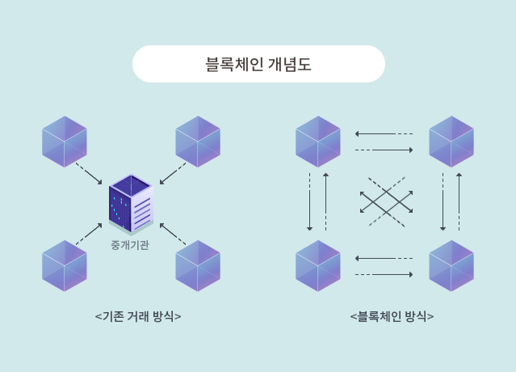
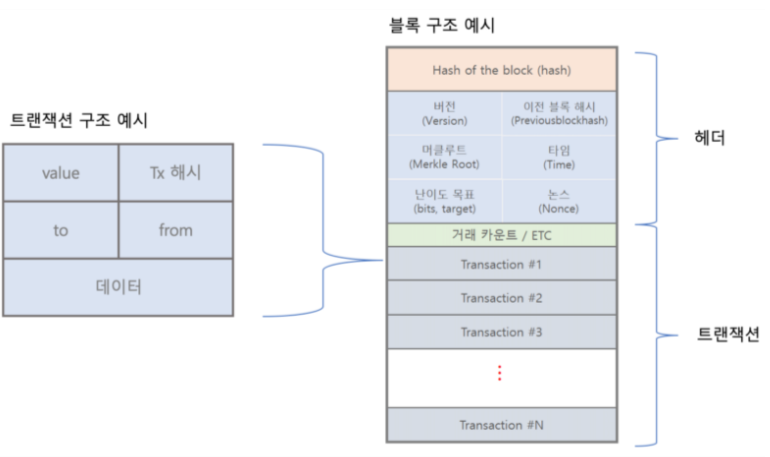


***
블록체인을 좀 쉽고 빠르게 습득하기 위한 포스팅.  

내가 블록체인을 공부할 때에는 읽어도 정말 읽어도 몰랐다  
순서대로 했다면 이해가 더 쉬웠겠다라고 느꼈던 그대로  
기초부터 정리해봤다.  
1. 블록체인이란? 
2. 블록은? 
3. 블록체인 : 말그대로 블록이 체인 형태로 이어져있는 형태. 개발자에게겐 노드가 체인처럼 쭉 연결되어 있는셈. 
왜 여기저기에서 블록체인 이야기가 들릴까?
그건 블록체인이 디지털 데이터를 신뢰할 수 있게 만들어준 기술이기 때문이다. 

 블록체인은 탈중앙화(decentralization)기술이다.   
우리는 입출금을 하기 위해서 은행을 이용한다. 나의 계좌내역은 당연히 은행이 관리한다.
내가 친구에게 돈을 송금한 것은 은행이 증언해준다. 이렇게 어떠한 정보나 권한이 한 곳에 집중되어있는 기존방식의
보안은 은행에 집중되어있고 그만큼 해킹의 주 타겟이 된다. 

반대로 블록체인은 정보나 권한이 분배되어 분산되어있는 방식을 갖는다. 
내 거래내역이 은행창고에만 있는 것이 아니라 모두가 소유함으로써, 
내 거래내역을 가진 모두가 증인이며 증거가 된다.

더 쉽게 생각하면, 사탕을 은행에 숨기던 방식  - 은행이 강도당하면 내 사탕도 사라짐 
사탕을 내 이름을 적어서 사거리 신호등에 둔다 - 모두가 감시자이자 목격자. 안정성이 보장된다.  

은행의 데이터를 조작해서 송금 내역에 변화를 줄 수 있다면
블록체인에 올라와있는 <U>블록은 수정,삭제가 불가능한 형태이다.</U> (아래 설명)  

그럼 블록을 알아보자.  

2. 블록은 ? 개발자는 노드를 상상하면 이해가 쉽다.  

**블록의 구조**부터 보자. 
블록은 데이터를 저장하는 단위로 블록헤더와 블록바디로 나누어져서  
블록헤더에는 버전, 이전 블록해시, 머클루트, 타임, 난이도 목표, 논스(nounce, 암호화와 관련되는 임의의 수)  
블록바디에는 트랜잭션들(거래내용)이 담아져있다.   
트랜잭션에 많은 거래내역이 담겨있다. 일정한 시간동안의 거래내역이 한 블록에 담긴다.(약 10분이며, 코인마다 다름 )

주목해야하는 부분은 블록해시이다. 이는 블록의 주소이자 이름이라 할 수 있다. 
블록은 이전 블록해시를 갖음으로써 서로 연결된 형태의 블록체인이 완성된다. 

이제 위에서 말한 <U>블록체인의 블록은 수정, 삭제가 불가능한 형태</U>라 한 이유가 이제 나온다. 
블록해시란 
블록헤더의 정보들(버전, 이전 블록해시, 머클루트, 타임, 난이도 목표, 논스)을 모두 합산한 후 SHA256으로 변환하여 만드는 해시 값이다. 

즉, A-B-C-D-E 로 이루어진 블록체인의 B.블록의 데이터를 수정하면 그 뒤의 C의 이전 해시값이 바뀌고 C의 해시값 또한 변경되고 D, E 의 해시값 
또한 변화가 있게된다. 

블록체인은 서로가 감시자인 형태로 블록의 정보를 모두 공유한다. 여기에 해당되는 '모두'의 과반수가 갖는 정보를 신뢰하는 형태를 띄기 때문에
수정을 위해서는 이 과반수가 가진 C,D,E 블록의 해시값을 손봐야한다. 이는 천문학적인 시간과 머니가 들어 불가능에 가깝다! 

이로써 블록체인은 보안을 유지할 수 있다.  

블록체인은 새로운 신뢰/보안의 형태이다. 이제 시작이고 가야할 길이 멀고도 험하다 
 ERC20? 토큰이랑 코인? 스마트컨트랙트? 블록체인을 공부하면서 어려웠던 이것들 모두 짚고 넘어가보자. 

다음은 스마트컨트랙트에 대해 알아볼거다.

