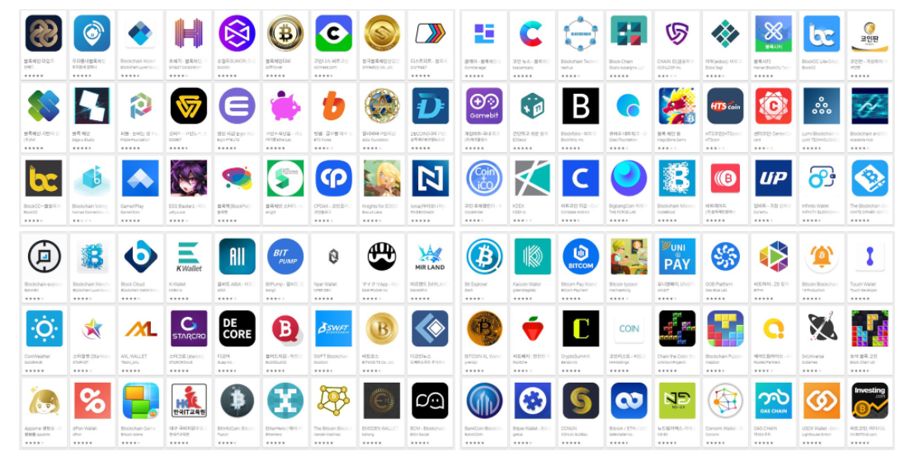


* * *
1. 코인과 토큰의 차이.
2. ERC20? 
3. Dapp(디앱)?? 

**1. 코인과 토큰의 차이.** 
코인은 **<U>자체적인 블록체인 네트워크</U>**를 가지고 웅용되어 지는 것 
토큰은 코인의 **<U>기존 블록체인 네트워크</U>**를 차용해서 운용되어 지는 것이다.  
대표적인 비트코인, 이더리움 등을 제외한 대부분은 토큰이다. (이더리움의 코인 이름은 이더..!)  

그렇다고 영원히 토큰이냐? 그것도 아닙니다. 메인넷이라고 기존에 존재하는 플랫폼에 종속 되어있지 않고
독립적으로 생태계를 구성하는 것이 있습니다. 
토큰에서 코인이 되는 과정  
기존 블록체인 네트워크를 기반으로 토큰을 제작하고, ICO(initial coin offering) 들을 통해 대중에게 알립니다.
(ICO: 백서를 공개한 후 신규 암호화폐를 발행해 투자자들로부터 사업 자금을 모집하는 방식)
이후 테스트넷으로 실제 실행이 잘되는지 확인하는 과정을 거쳐 이가 성공하면 메인넷이 릴리즈 된다. 
독립적인 플랫폼으로 거래하고 생태계 구성이 된다는 것이다. 이거시! 토큰에서 코인으로 업그레이드가 되는 과정이다.
예) 이오스토큰 -> 이오스 코인

**2.이제 ERC20이 무엇인가** 
이더리움의 자체 블록체인 네트워크 상에서 발행되는 <U>토큰의 호환성을 보장</U>하기 위한 표준 사양을 말합니다. 
위의 정의처럼 토큰은 블록체인 네트워크를 사용하여 만들어진 것이잖아요? 만들때 최소한의 조건이 ERC20인거죠.  
그래서 ERC20의 표준 사양을 맞춘 토큰을 ERC20토큰이라 부릅니다. 

**3. Dapp(디앱)??** 
디앱이란 블록체인을 기반으로 돌아가는 애플리케이션을 말한다. 
모바일의 OS 안드로이드와 iOS 처럼 블록체인계의 OS에서 돌아가는 애플리케이션.

디앱은 블록체인에서 스마트 계약이 도입되면서 생겨났다(이더리움이 처음 도입).  스마트 계약이 없는 비트코인에는 디앱이 존재하지 않는다.
스마트컨트랙트가 포함된 블록체인 네트워크 위에서 돌아가는 어플리케이션이라 정리할 수 있다.   
**예를 들자면** 배달의 민족 어플에 만약 30분 안에 배달이 완료되면 자동 결제가 되는 스마트컨트랙트를 추가한다면 Dapp이라 할 수 있다.
이처럼 디앱의 종류는 코인관련 뿐만 아니라 **안드로이드의 앱처럼 모든 앱**이 될 수 있다.  

현재 여러 블록체인 플랫폼들이 있는데 대표주자가 이더리움이다. 처음 블록체인에 스마트 계약을 도입하며
디앱을 탄생시킨게 이더리움이기도하고 디앱 수로 봤을때도 1위가 이더리움, 2위는 이오스. 그 수가 
이더리움이 2,341개이상, 이오스는 235개로 차이가 엄청나다. 

본래 각각의 앱을 사용하면서 발생되는 일정부분의 포인트를 통합하여 사용하는 것은 같은 회사계열의 앱이 아닌 이상 거의 불가능하지만
이더리움 플랫폼에서는 각각의 디앱이 발행한 <U>토큰들을 통합</U>하여 현금화하는 것이 가능하다.

즉, 대표적인 이더리움 블록체인에서는 이더(ETH)가 사용되고, 
이더리움 블록체인 상의 디앱은 또 다른 다양한 분야에 적용될 수 있는 
각각의 솔루션으로 그에 맞는 토큰을 발행하는 것이다. 이때 호환성을 위해 정한 표준 토큰 스펙이 ERC-20이라는 것! _ 한 줄 정리

**내용 계속 추가 할 예정**

