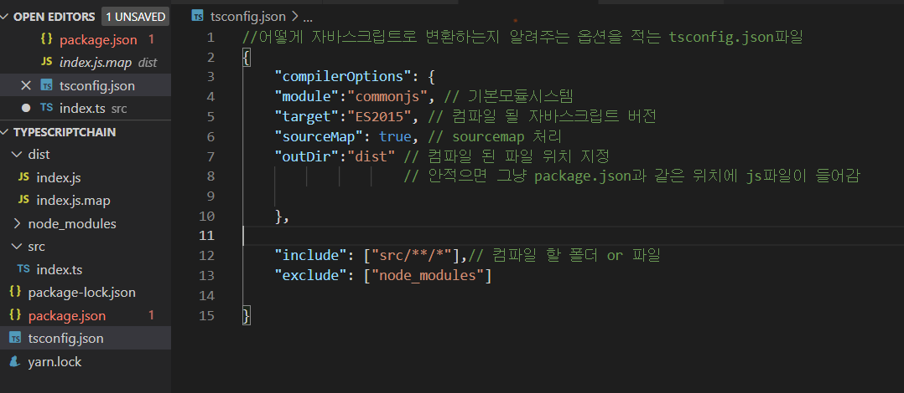
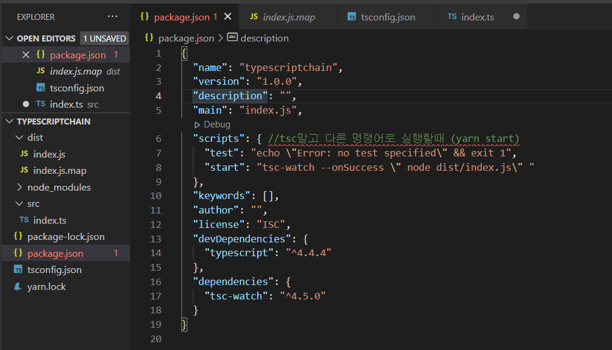


* * *
블록체인은 대충 알겠고 그래서 코드는 어떻게 쓰는데?  
해서 냅다 니콜라스의 도움으로 typescript로 간단 블록체인 구조를 생성해보았다. 

일단 왜 타입스크립트를 사용? 
자바스크립트가 갖고있지 않는 규칙을 가지고 있다. 
-> 대형 프로젝트, 팀으로 일할 경우 버그를 최소화하기 좋다
-> 언어가 예측 가능하고 읽기 쉬운 코드로 자바스크립트를 더 잘 사용할 수 있게 해준다. 

먼저, **기본 설정**  
Yarn 은 프로젝트의 의존성을 관리하는 JavaScript의 패키지 매니저 
= Java의 gradle 

npm 보다 빠르고 안전하며 npm과 같이 자바스크립트 패키지의 저장소를 제공할 뿐만 아니라
시스템에서 의존 패키지 설치하거나 업데이트하는 등의 다양한 명령을 제공, package.json을 통해 의존 패키지를 구분한다. 

하지만 나는 yarn 이 돌아가지 않아서 npm을 사용했다.  
* 1.yarn initialize  
(> yarn init) 또는 
(>npm init )  

* 2.타임스크립트 설치   
  (> yarn global add typescript) 
또는
  (> npm install typescript)

* 3.tsconfig.json 파일 생성  
타임스크립트가 어떻게 자바스크립트로 컴파일 할지 명시해둘 파일

* 4.index.ts 파일 생성 
블록체인 만들 ts 파일 -> 컴파일하면 index.js가 생성됨

* 5.컴파일은 tsc 또는 npx tsc  
여기까지하고 컴파일 실행해보자

* 6.tsc-watch 패키지 설치 
원래는 ts코드가 바뀔때마다 js로 컴파일 하고 node로 실행 
-> ts코드가 수정 될때마다 자동으로 컴파일하고 js를 실행해줌 (쉽게 말해 tsc의 watch모드 ) 
  (> yarn add tsc-watch --dev 또는 npm add tsc-watch --dev) 
그니까 tsc, yarn start, yarn start를 계속 안쳐도 수정될때마다 알아서 컴파일, 실행 되서 출력값 띄워줌 
  
참고로 yarn으로 init했을때와 npm 으로 init했을때의 package.json 형태가 다르다.  
yarn의 경우 "script"가 없으니 추가해주면 되고 
npm의 경우 "test"까지 만들어져있으니 "start"만 추가해준다.  

> 블록체인 생성

1.이제 index.ts에 냅다 블록 구조 만들기
~~~ javascript
class Block {
  public index:number;
  public hash: string;
  public previouHash: string;
  public data: string;
  public timestamp: number;
constructor(
  index: number,
  hash string,
  previousHash: string,
  data: string,
  timestamp: number
) { 
  this.index = index;
  this.hash = hash;
  this.previousHash = previousHash;
  this.data = data;
  this.timestamp = timestamp;
 }
}

~~~
2.블록 생성과 블록체인배열 생성 시험 
~~~ javascript
//블록 생성
const genesisBlock:Block = new Block(0, "202020202020", 
"", "Hello", 123456);
// 블록 배열 생성 
let blockchain: Block[] = [genesisBlock];
~~~

지난번 블록 설명 포스팅에서 블록의 이름 블록해시는 블록이 가진 여러요소들의 합을 SHA256으로 변환한 값이라고 했다. 
3.그럼 해시값을 만들어볼까나! 
 crypto-js 설치부터! 
(> yarn add crypto-js 또는 npm install crypto-js)
~~~ javascript
//import 추가
import * as CryptoJS from "crypto-js";

//블록 클래스 안에 블록해시를 만드는 static calculateBlockHash 함수 추가  
static calculateBlockHash = (index:number, previousHash:string, timestamp:number, data: string ) : string => 
  CryptoJS.SHA256(index +previousHash + timestamp + data).toString();

//블록생성하는 함수 생성 
const createNewBlock = (data:string) : Block => {
   const previousBlock : Block = getLatesBlock();
   const newIndex : number = previousBlock.index + 1;
   const newTimestamp : number = getNewTimeStamp();
   const newHash : string = Block.calculateBlock(
       newIndex,
       previousBlock.hash, 
       newTimestamp, 
       data
   );
   const newBlock : Block = new Block(
     newIndex, 
     newHash,  
     previous.hash,
     data,
     newTimestamp 
   );
   addBlock(newBlock); //블록체인에 블록 추가 --아래에 추가되있음
   
   return newBlock;
 };

~~~

이제 블록을 검증하는 절차를 거쳐야지. 
4.구조와 해시값을 검증한다. 
~~~ javascript
//블록의 구조 검증 메서드 (블록 클래스 내에 추가) 
static validateStructure = (aBlock : Block) : boolean => 
typeof aBlock.index === "number" && 
typeoff aBlock.hash ==="string" && 
typeof aBlock.previousHash === "string" &&
typeof aBlock.timestamp === "number" &&
typeof aBlock.data === "string";

//블록해시 값이 맞는지 확인하는 메서드 
const getHashforBlock = (aBlock: Block) : string => 
  Block.calculateBlockHash(aBlock.index, aBlock.previousHash, aBlock.timestamp, aBlock.data);
//블록의 해쉬가 유효한가 , 따로 해쉬를 계산해서, 들어온 블록의 해쉬가 실제로 있는지 체크
~~~
5.위 두 검증을 거치는 isBlockValid 메서드 생성
~~~ javascript
//candidate 블럭과 previous 블럭을 비교 
const isBlockValid = (candidateBlock : Block, previousBlock: Block) :boolean => {  
  if(Block.validateStructure(candidateBlock)) { //구조 검증 
     return false;
 } else if (previousBlock.index +1 !== candidateBlock.index ) {//인덱스 검증 
    return false;
 }  else if (previousBlock.hash !== candidateBlock.previousHash) { // preHash 검증
   return false;
 } else if (getHahforBlock(candidateBlock) !== candidateBlock.hash) { // 현 블록해시 검증 
  return false; //블록의 해쉬가 유효한가 , 따로 해쉬를 계산해서, 들어온 블록의 해쉬가 실제로 있는지 체크
 }  else {
  return true;
 }
};
~~~

6.createNewBlock 에서 사용할 블록체인에 블록 추가하기 메서드 
~~~ javascript
const addBlock = (condidateBlock: Block) : void => {
  if(isBlockValid(candidateBlock, getLastBlock())) {
     blockchain.push(candidateBlock);
  }
};

~~~
실행
~~~ javascript
createNewBlock("첫 블록");
createNewBlock("아더 블록");
~~~

