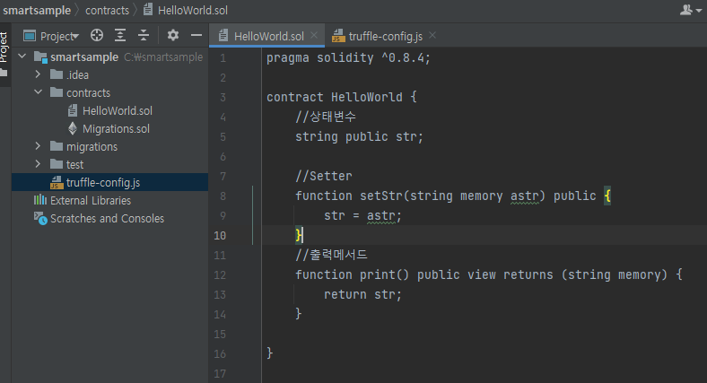
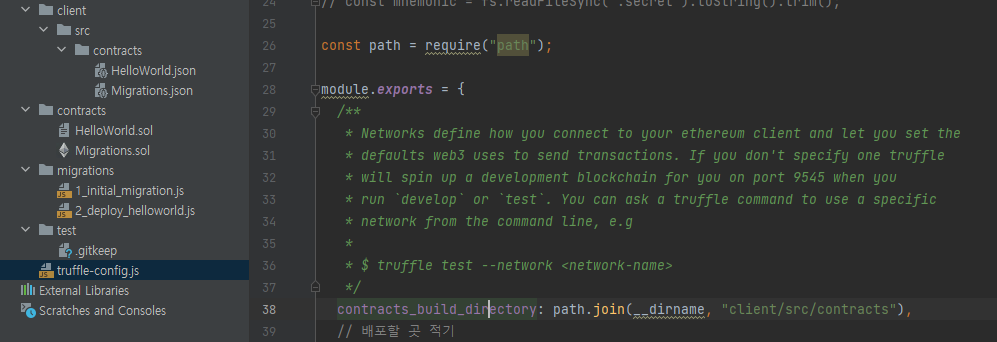
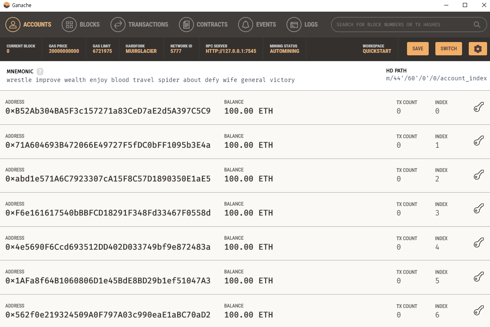
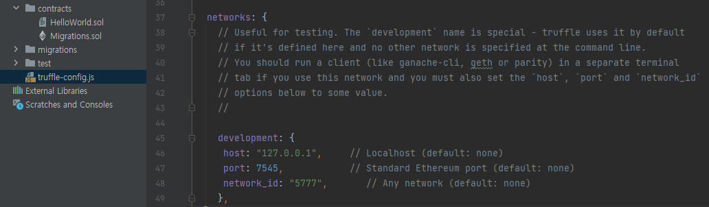
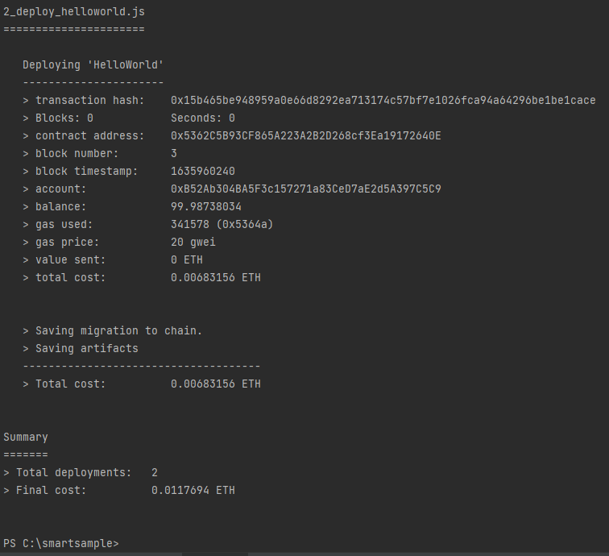
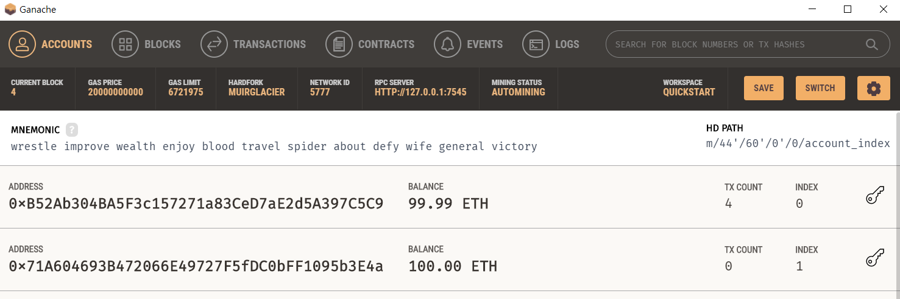


* * *
오늘은 스마트컨트랙트 개발을 해볼겁니다.

##1. 개발도구  
먼저 개발환경 조성부터 샤샥 나열해보겠습니다. 
Solidity(솔리디티) : 이더리움의 스마트컨트랙트 프로그래밍 언어입니다.  
Truffle(트러플): 컴파일, 배포, 디버깅을 지원하는 개발 도구입니다.  
Ganache(가나슈) : 가상의 이더리움 네트워크를 생성해줘서 스마트 컨트랙트를 실행할 수 있게해주는 모듈입니다. 
-> https://www.trufflesuite.com/ganache 에서 다운로드  
IDE는 인텔리제이를 사용했습니다. 설치하지 않은 경우에는 Remix를 이용하세요  
-> https://remix.ethereum.org/ 

##2. 트러플 설치 
cmd 오픈 
-> npm install -g truffle  (npm으로 트러플 설치 ) 
-> truffle version (버전 확인) 
Truffle v5.4.16 (core: 5.4.16) 
Solidity v0.5.16 (solc-js)      
Node v11.15.0 
Web3.js v1.5.3 

##3. 프로젝트 생성 
-> mkdir smartsample (트러플 프로젝트 만들기 위한 폴더 생성 ) 
-> cd smartsample 
-> truffle init (트러플로 프로젝트 초기화) 
-> dir 폴더 안 확인 
2021-10-30  오전 01:16 contracts ( 스마트컨트랙트 작성 ) 
2021-10-30  오전 01:16 migrations (배포 디렉터리) 
2021-10-30  오전 01:16 test (단위 테스트 공간) 
1985-10-26  오후 05:15  4,900 truffle-config.js ( 트러플 관련 설정 파일)  

##4. 인텔리제이 오픈 
이제 contracts 디렉터리 안에 스마트컨트랙트를 작성한다.  
-> contracts/HelloWorld.sol 생성  

~~~ javascript
pragma solidity ^0.8.4;   
//컨트랙트 이름 HelloWorld가 됨
contract HelloWorld {
    //상태변수
    string public str;
    //세터
    function setStr(string memory astr) public {
        str = astr;
    }
    //출력메서드
    function print() public view returns (string memory) {
        return str;
    }
}
~~~
1) solidity 버전 변경 
-> truffle-config.js 내에 compilders 키 안에 version부분을 최신으로 수정,  
솔리디티파일의 pragma solidity 도 수정  

##5. 컴파일 
솔리디티 파일 HelloWorld를 컴파일한다. 
PS C:\smartsample> truffle compile 
build/contracts/컴파일된 json 파일들 생성됨 

강제 컴파일시 (수정이 없을시) 
PS C:\smartsample> truffle compile --all  

컴파일된 HelloWorld.json 파일에서  
bytecode는 실제로 이더리움 메인넷상에 블록안에 심어지게되서 실제 evm 상에서 동작하는 바이트코드가 된다. 

abi (Application binary Interface)는 
: 배포후 어플리케이션에서 바이트코드와 통신할때 사용되는 인터페이스를 정의해놓은 하나의 데이터이다.  

TMI! 혹시 컴파일된 json 파일의 생성위치를 바꾸고싶다면

##6. 가나슈 (가상의 이더리움 네트워크을 이용해보자) , 이더리움 네트워크 접속  
가나슈 다운로드  
-> https://www.trufflesuite.com/ganache  
실행 - Quick Start 클릭 (트랜잭션을 저장하지 않음) 

10개의 가상 계정에 각 100이더의 잔액있음  

truffle-config.js에 가상의 이더리움 네트워크 접속 정보 입력  

##7. 배포 

migrations 디렉토리에 1_initial_migration.js 처럼 배포할 js 파일을 생성한다. 
생성시 이름은 1 다음 숫자 2로 지어준다.  
2_deploy_helloworld.js 
이유는 이 숫자를 보고 순서대로 배포되기 때문임! 

2_deploy_helloworld.js 
~~~javascript
const HelloWorld = artifacts.require("HelloWorld");
/*네이밍 중요
* 순번 중요
* 순번 기준으로 배포함
/*
module.exports = function (deployer) {
  deployer.deploy(HelloWorld, "HelloWorld");
                // 생성자 아규먼트 (생성할때 파라미터 필요 )
};
*/
module.exports = function (deployer) {
  deployer.deploy(HelloWorld);
};
~~~

**배포 명령어** 
PS C:\smartsample> truffle migrate --network development 
트러플아 network키에서 develpoment 파라미터를 갖고 migrate해라!  
기본 명령어는  
PS C:\smartsample> truffle migrate 
강제 배포 
PS C:\smartsample> truffle migrate --reset  

## 확인 

1_initial_migration.js와 2_deploy_helloworld.js 둘 다 실행됐다.  
가스비가 빠져나간것도 확인 할 수 있다. 

가나슈에서도 확인 

0.01이더가 빠져나갔다. 구우웃

