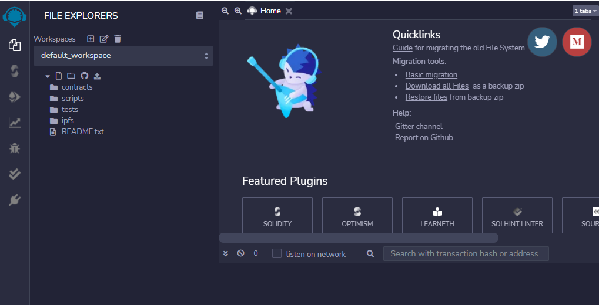
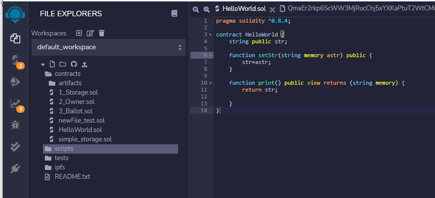
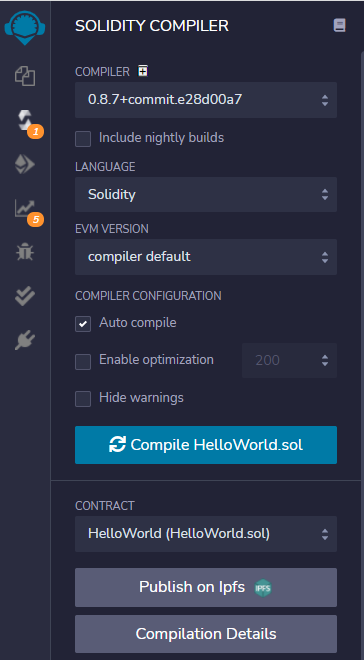
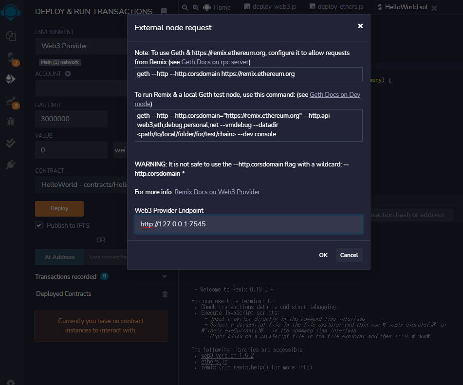
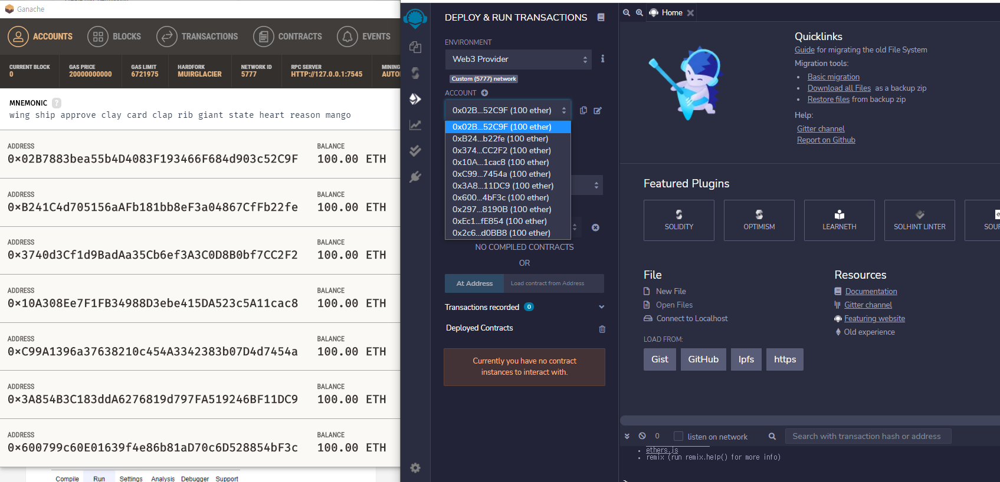
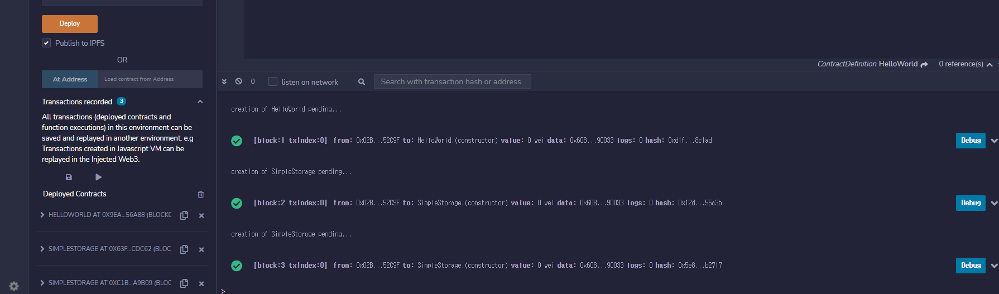
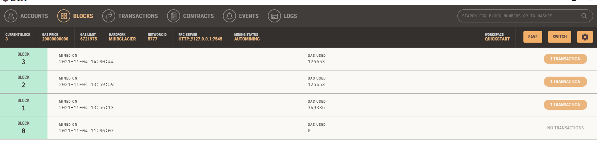
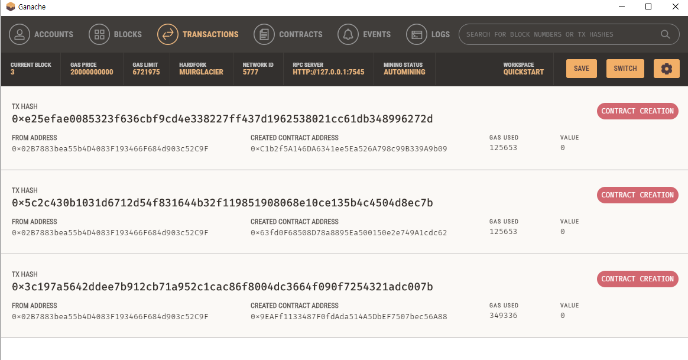


* * *
<h6>지난 포스팅에서는 IDE를 IntelliJ를 사용했습니다. 
이번 포스팅은 이더리움에서 제공하는 IDE Remix를 사용하는 포스팅입니다.</h6>

시작전에 간단하게 스마트컨트랙트 배포의 큰 줄기는 
코드작성 -> 컴파일 -> 가상 블록체인 네트워크 연결 -> 배포
(로 생각하고 가시면 좋을것같습니다. )

암튼 스타또  
가나슈를 켜두시고  
**Remix 접속**  -> [https://remix.ethereum.org](https://remix.ethereum.org)  

일단 제일 왼쪽에 
첫번째 아이콘은 File explorers 
두번째 아이콘은 Solidity Compiler 
세번째 아이콘은 Deploy & run transactions 
차례대로 작성, 설정해보자. 

**1. File explorers** 
Workspace 이다. 프로젝트 구성도 전 포스팅과 유사하다  
스마트컨트랙트를 작성하는 constracts, 테스트  
컴파일된 파일은 constracts/artifacts/ 하위로 들어간다.  

전과 같이 constracts/HelloWorld.sol 작성, 
(이번엔 simple_storage.sol 하나를 더 만들었다) 

**2. Solidity Compiler**

말그대로 컴파일러 관련 설정파트이다.  
**COMPILER**는 <U>버전 설정</U> -> 안정적인 버전으로 추천. 나는 0.8.4버전 사용 
**LANGUAGE**는 <U>솔리디티 선택</U> 
자동 컴파일 체크 

TMI! 컴파일할 파일을 클릭하고 돌아와야 파란색 Compile 버튼이 클릭 가능하다. 
그리고 Compilation Details를 클릭하면 컴파일된 bytecode와 abi 확인이 가능하다.  

컴파일된 json 파일은 constracts/artifacts 하위로 들어간다.  

**3. Deploy & run transactions** 
배포파트! 그리고 트랜잭션 설정이다.  
가나슈의 네트워크와 연결하기위해 **ENVIRONMENT** 로 **Web3 Provider** 클릭

연결완료!

가나슈의 가상 계정들이 ACCOUNT 항목에서도 나타나는걸 볼 수 있다.  

이제 배포!!Deploy 클릭  

저는 배포를 세번 했고 블럭이 생성되었다고 띠롱띠롱뜹니다.  

가나슈에서도 블록이 생성된것을 확인 할 수 있습니다.  

Transaction 을 누르면 방금 배포를 하면서 발생시킨 transaction이 들어있습니다. 

이렇게 Remix 에서 스마트 컨트랙트 작성과 배포를 마쳤습니다.

