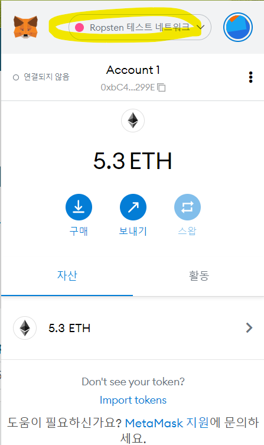
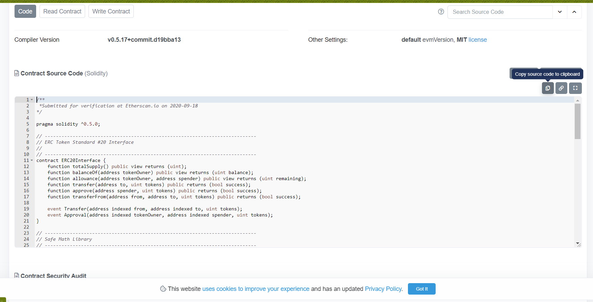
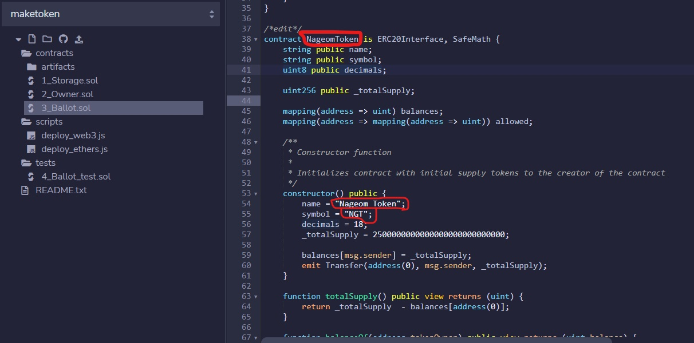
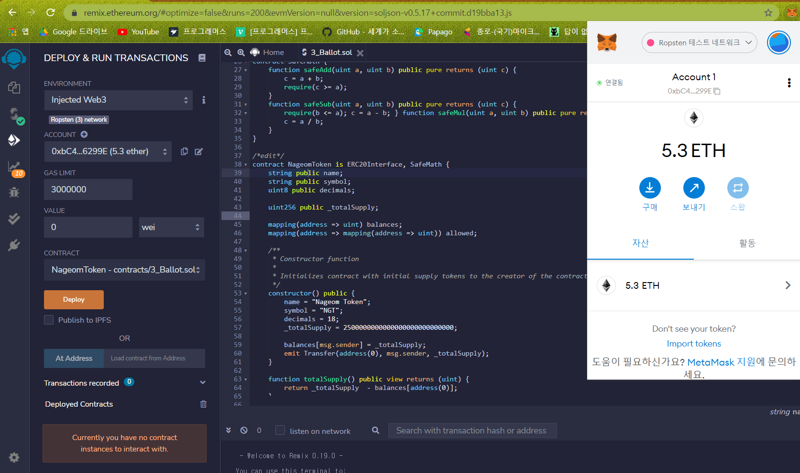
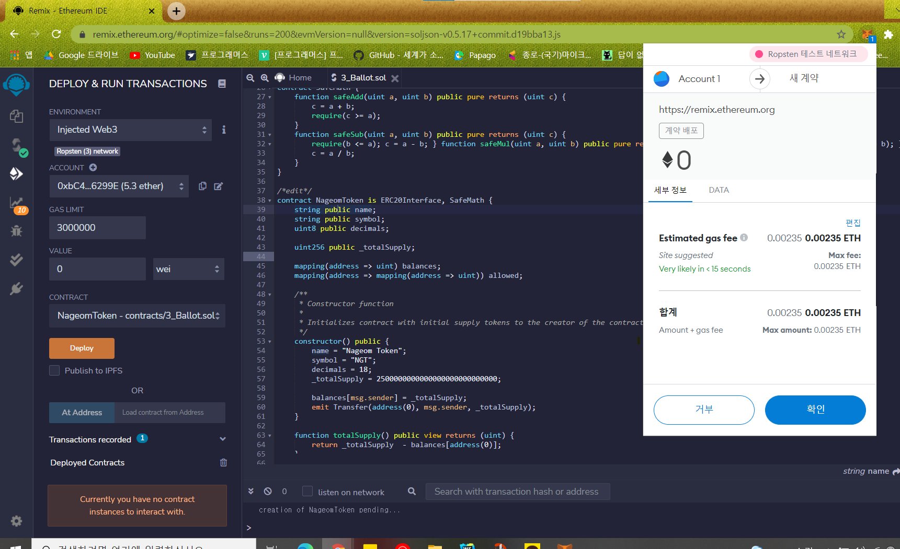
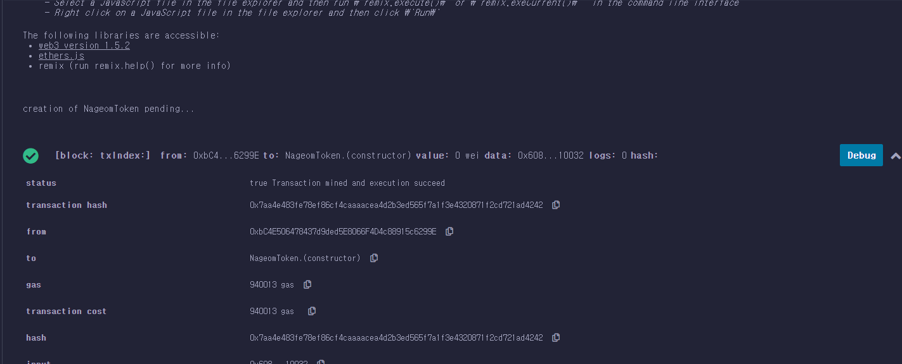
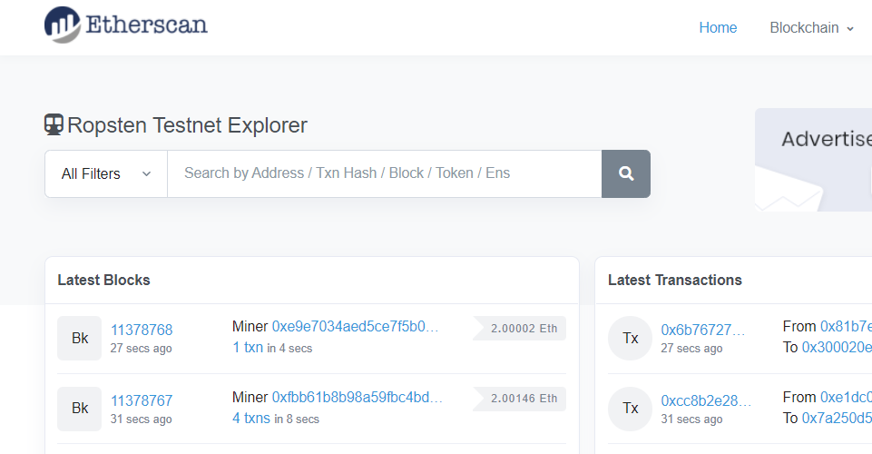
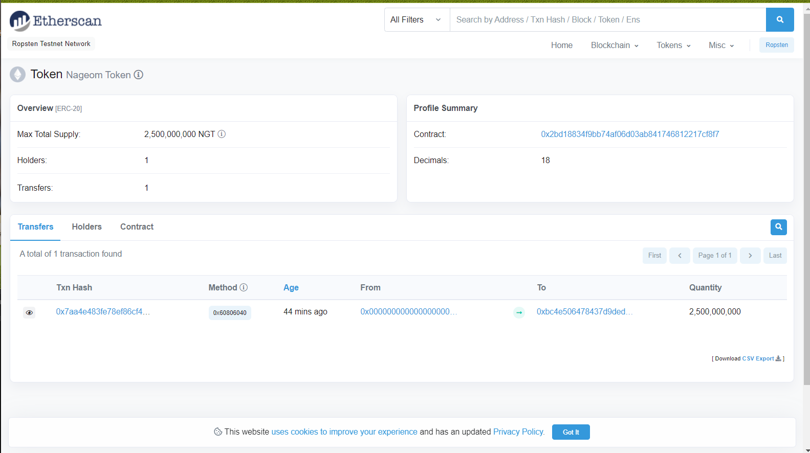
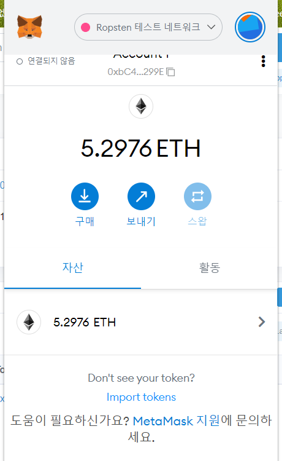
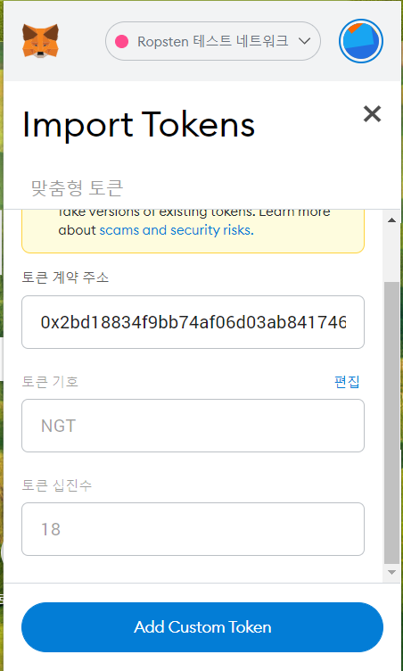


* * *
오늘은 ERC20토큰을 만들어보기~!  
전 포스팅을 하나식 보셨다면 이더리움 관련 개발은 
Remix IDE가 필요하다~ 를 아실거에요  

오늘은 <U>ERC20토큰을 만드는데 필요한 개발도구</U>는 
Remix IDE , 메타마스크(암포화폐 지갑), 토큰 올릴 가스비 (이더) , 제공된 ERC20 소스코드 
가 있습니다. 
<h6>ERC20 토큰 만들기의 큰 흐름은</h6>
일단 Remix IDE에서 ERC20 소스코드를 가지고 토큰을 만들거구요. 
토큰을 만들어서 배포할때 필요한 가스비(이더)는 Ropsten 테스트넷에서 받아올겁니다.

<h6>1. 테스트용 Ether 받아오기</h6>  
이제 스마트컨트랙트를 배보할 때 Gas가 필요하다는 것을 아실텐데,
기존에는 가나슈에서 가상계정과 이더를 제공해줬기 때문에
배포시 필요한 가스를 지불 할 수 있었지만 
현재는 실제 우리의 메타마스크를 사용하기때문에 이번엔 가스비가 필요합니다. 어떡하지.. 했는데
이럴때 사용할 수 있는 테스트용 이더가 있더라지요~ 
요 사이트는 Rinkeby, Ropsten 등이 있지만
저는 Rinkeby 에서 페북에 게시물 올리고 어쩌구해야하는데 하다가 실패했기 때문에

 Ropsten 테스트넷에서 받아올겁니다.  
[https://faucet.dimensions.network/](https://faucet.dimensions.network/)  
이 사이트에 본인 메타마스크 계정을 넣어주기만 하면 바로 받으실 수 있습니다. (간단해서 첨부안함)

받고나면 내 지갑의 Ropsten 테스트 네트워크 항목에서 이더를 확인하실 수 있습니다. (네트워크 항목 선택하셔야해요!)

<h6>2. ERC20 소스코드 받아오기</h6>  
디어리움에서 제공하는 ERC20 소스코드를
[https://etherscan.io/address/0x6D0F5149c502faf215C89ab306ec3E50b15e2892#code](https://etherscan.io/address/0x6D0F5149c502faf215C89ab306ec3E50b15e2892#code)

복사하시면 돼요.
Copy source code to clipboard 클릭 

<h6>3. Remix IDE 로 ERC20토큰 만들기</h6>  
[https://remix.ethereum.org/](https://remix.ethereum.org/)
workspace에 Ballot.sol 파일 내용을 지우고  
ERC20 소스코드를 붙여줍니다. 

38번 줄의 컨트랙트를 수정해주세요. 만들 토큰의 관한 정보입니다. 
컨트랙트 이름은 내 토큰이름으로. (띄어쓰기 없이) 
그 아래 생성자 constructor의 name, symbol 항목도 고쳐준다.  
name은 토큰이름, 
symbol은 내 토큰별칭 이라 생각하면 됨.   
<<<<<<<<<<<<이제 배포준비  

ENVIRONMENT : Injected Web3 선택, 
ACCOUT: 리믹스와 메타마스크 연결되어 내 지갑계정을 확인할수있음 
내 지갑에 연결됨(초록) 이 뜨는것도 확인됨 
☆중요중요☆ CONTRACT: 컨트랙트는 내가 아까 수정한 컨트랙트 선택

deploy: 코드를 이더리움에 배포 클릭!

올릴때 가스비가 소비하나요? 라는 안내문이 뜹니다. 확인 클릭
  
잠깐 시간이 지나면 터미널에 블록이 생성되었다고 뜹니다. 

<h6>4.테스트넷에서 트랜잭션 확인, 메타마스크에 잔고확인 </h6>
우리가 테스트넷 이더를 받은 곳 ropsten의 이더스캔을 이용해 방금 우리가 일으킨 트랜잭션을 자세히 볼 수 있다. 
[ropsten.etherscan](https://ropsten.etherscan.io/)

이곳에 transaction hash를 검색 
   (transaction hash는 뒤에 Remix에서 배포 후 터미널에 블록생성이 됐다는 알림에서 얻을 수 있습니다.) 
검색 후 컨트랙트 배포에 대한 정보를 확인 할 수 있다. 

Interatcted With(To) 클릭 -> 만든 토큰의 정보확인  
Tracker 클릭 / 이때 나온 Contract: 주소를 복사한다.  

이유는 메타마스크는 이더 코인 전용이라 그 외의 코인,토큰들은 따로 추가해줘야하기 때문

import tokens 클릭

내가 만든 토큰이 추가됨을 확인할 수 있습니다.야호

