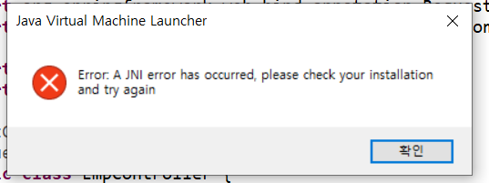
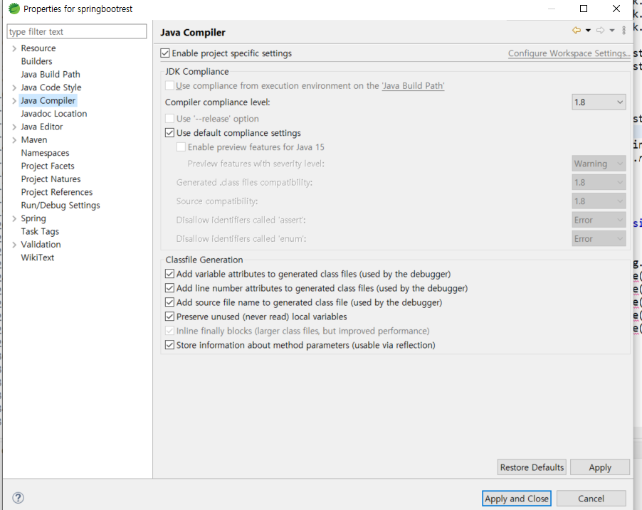
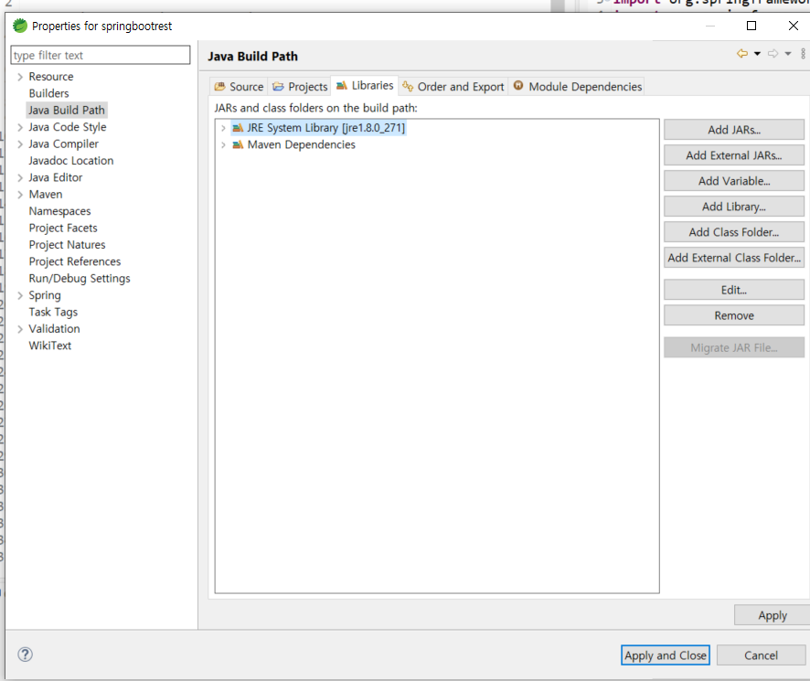
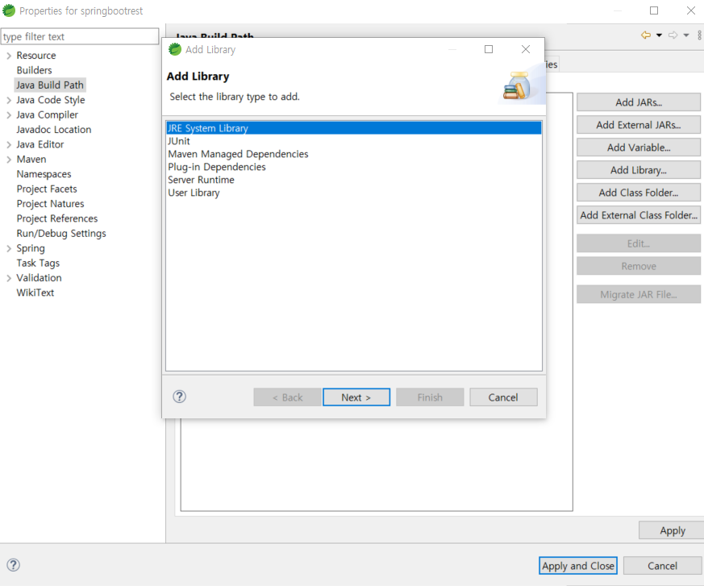

***

now.. no korean.. 
I will fix it later...   
Error: A JNI error has occurred, please check your installation and try again

project right click -> Properties      
Java Compiler -> Compiler compliance level-> change version

if problem again.. 
project right click -> 'Properties'   
'Java Build Path' -> 'Libraries'   
check the 'JRE System Library' is red     
Is it red??   

click 'Add Library...' on the right side   
->  click 'JRE System Library' !! 

 

 
