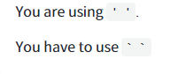
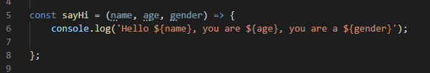
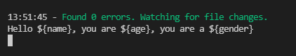
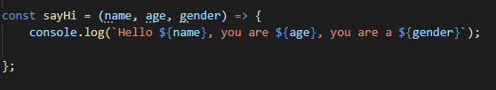
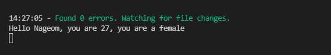

***

오늘 겪은 오류는 
{: width="800" height="200}
응? 뭐라는거야.. 
쟤는 서있고 쟤는 좀 누워있네..하고 찾아보니까 backtick (`) 이라고하는 새로운 문자연결 표기방식으로 키보드 **(Shift + ~)**를 치면 나온다

자바스크립트는 처음이라 진짜 몰랐다.. 
어디에 쓰이는고.. 하니 

처음에 내가 겪은 오류 
{: width="800" height="200}
{: width="800" height="200}
아니 다들 홀따옴표 썼는데 <U>${}(place holder)</U> 안에 변수 읽히던데 왜!! 나만 안돼!!!라고 했는데 
사실 홀따옴표가 아니역따 ㅎ

<h5>backtick (`)</h5>

얘의 명칭은 grave accent  
backtick, backquoto 라고도 불리며
'억음부호'라는 한국이름도 있다. 
<U>자바스크립트 ES6 부터 백틱 기호를 사용한 문자열을 템플릿 리터널</U>이라고 부른다.  
새로운 문자연결 표기방식인데, 
기존에 console.log("내 이름은" + name + "나이는"+ age); 식의 문자열 출력이  
따옴표("")와 더하기 기호(+) 없이 백틱 기호 하나로   
console.log(`내 이름은 ${name} 나이는 ${age}) 가 한줄에 출력 가능해진다. 
{: width="800" height="200}
{: width="800" height="200}

나처럼 이걸로 헤매는 사람은 없겠ㅣ..

 

 
