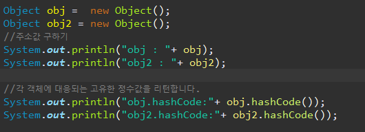
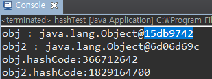
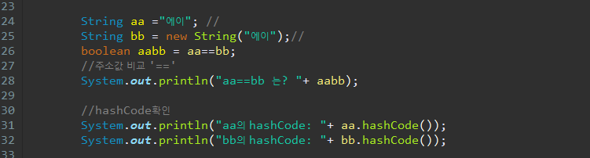
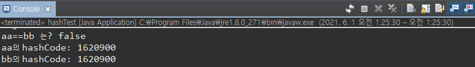

***
안녕하세요 오늘은 비교비교 equals 와 '==' 에 대해 알아보려합니다.    
우선  **equals**는 메서드   
**==연산자**는 비교를 위한 연산자입니다.   

   
**== 연산자**는 대상의 주소값을 비교하고
**equals**는 오버라이딩을 통해 원하는 값을 비교할 수 있도록 한다. 
 
우선 equals(Object obj) 
매개변수로 객체의 참조변수를 받아서 비교하여 그 결과를 boolean값으로 알려 주는 역할을 한다. 
Object 클래스에 정의되어 있는 equals메서드의 실제 내용
~~~ javascript
public boolean equals(Object obj) {
     return (this==obj);
}
~~~
이 코드에서 알 수 있듯이 두 객체의 같고 다름을 참조변수(주소값)의 값으로 판단한다. 
그렇기 때문에 서로 다른 두 객체를 equals 메서드로 비교하면 항상 false를 결과로 얻게 된다. 
~~~ javascript

public static void main(String[] args) {

 Obj obj1 = new obj(10);
 Obj obj2 = new obj(10);
 
 System.out.println(obj1.equals(obj2));// false 

class Obj {
  int value;
  
  Obj(int value) {
    this.value=value;
  }
}
~~~

**그렇다면 equals 메서드로 Obj 인스턴스가 가지고 있는 value값을 비교 하도록 할 수는 없을까?
이럴땐 Obj 클래스에서 equals메서드를 오버라이딩하여 주소가 아니라 객체에 저장된 내용을 비교하도록 변경하면 된다. 

~~~ javascript
class Person {
  int value;
  
  public boolean equals(Object obj) {
     if(obj instanceof Person) {
         return id==((Person).obj).id; //obj가 Object타입이므로 id 값을 참조하기 위해서는 Person타입으로 형변환이 필요하다. 
     }else{
         return false;
     } 
  }

}
class EqualEx2 {

 public static void main(String[] args) {
    Person p1 = new Person(1020);
    Person p2 = new Person(1020);

 if(p1 == p2) {
    System.out.println("두 객체는 같다");
 }else {
    System.out.println("두 객체는 다르다");
 
 }
 if(p1.equals(p2)) {
    System.out.println("두 객체는 같다");
 }else {
    System.out.println("두 객체는 다르다");
 
 }
~~~
결과값은 
"두 객체는 다르다"
"두 객체는 같다"
가 나왔다. 

String 클래스 역시 

> hashCode란?

Object클래스는 hashCode() 라는 메서드를 가지고 있습니다   
hashCode() 메서드는 말그대로 hashCode를 생성해 리턴해주는 메서드이죠   
hashcode란 Object클래스의 메서드가 리턴하는 각 객체에 대응하는 고유한 정수값을 이야기하며       
  
기본적으로 hashCode는 객체의 주소값과 연관이 있습니다
   

비교했을때 주소값이 다른 obj와 obj2의 hashcode값이 다르죠   
그리고   
obj2의 주소값 @ 뒤의 값 6d06d69c (16진수) -> hashCode 1829164700(10진수) 값으로
변환이 되는것을 볼 수 있습니다.   
 
그렇다면 주소값만으로도 hashCode처럼 대상을 비교할 수 있지않나?
그럼 equals랑 ==이랑 같게 쓰여야하는거 아닌가?
라는 생각을 했었는데    
멍-충   
주소값이 서로 다르지만 문자열은 같은 두 String 객체를 가지고 hashCode를 비교해보았습니다. 

주소값은 다르지만 같은 문자열에 대해 hashCode가 같은 것을 볼 수 있습니다.    
**[응? 주소값으로 hashCode만드는데 주소값이 다른데 hashCode가 같네? 모순모순!]**
이라고 할 뻔 했지만   
 
    
> String의 hashCode() 는 재정의가 되어 사용된다. 

가 정답입니다. 

String은 문자열이고 "에이"와 "에이"가 주소가 다르다고 다른말이라면 hashCode의 의미가 없을뿐더러 발생할 수 있는 나쁜 예로    
-> HashMap에서 일치하는 key 값을 찾아낼 수 없게 되겠죠   
그래서 String은 hashCode를 생성할 때 주소값 말고 문자열로 생성하는 것으로 hashCode() 메서드가 재정의 된 것이랍니다.   

여기까지 equals메서드와 '=='연산자의 간단한 차이였습니다.    
* * *    

아래는 String 기본 설명 살짝 덧붙여봤습니다.

우선 spring 둘의 주소값이 다른 이유   
~~~ java
String aa = "에이";
String bb =new String("에이");
~~~
리터널 aa변수는 stack 메모리에, "에이"라는 문자열은 Heap 메모리 내에 String pool 이라는 곳에 저장. 그 주소가 aa변수에 저장됩니다. 
또한 String pool에 저장될때 intern() 이라는 메서드가 실행되는데    
intern() = 같은 값이 있는 경우 기존 값의 메모리 주소를 사용하고, 다른 값일 경우 객체를 생성해 값을 저장하고 그 메모리 주소를 리턴합니다.
Spring pool이 HashMap 자료구조 형태로 중복된 데이터 저장을 막습니다. 
그래서
~~~ java
String c = "씨";
String cc = "씨";
c == cc --> true 
~~~
라는 결과를 얻게되는것이죠.    

반대로    
 new 연산자 사용시 bb은 stack메모리에, "Hello" 는 일반 Heap 메모리 내에 생성되어 문자열이 같더라도 계속 새로운 인스턴스가 생성되게 되는것입니다.   
그렇다면 메모리관리를 위해서라도 String은 리터널로 생성하는것이 권장되겠죠?   
오늘도 화이팅입니다!

 

 
