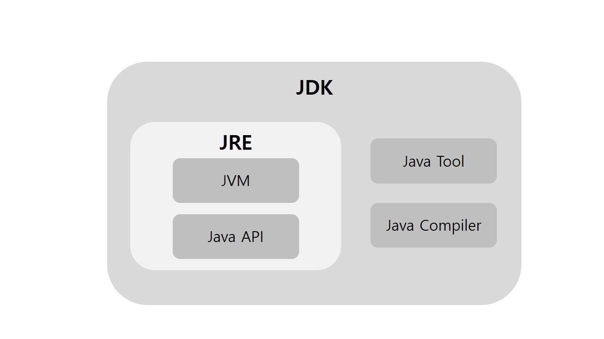
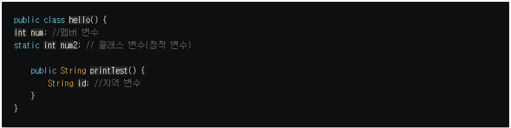

***
면접질문을 공부하면서 정리해둔 메모
<h5><자바 JVM, 컴파일러, JDK와 JRE></h5>

JDK - (Java Development Kit) 자바 애플리케이션을 구축하기 위한 핵심 플랫폼 구성요소     
&nbsp; &nbsp; &nbsp; &nbsp;- 개발자들이 JVM과 JRE에 의해 실행되고 구동될 수 있는 자바 프로그램을      
&nbsp; &nbsp;&nbsp; &nbsp; 생성할 수 있게 해준다.

JRE - 자바코드가 실행 될 수 있는 환경 , JVM을 생성하는 디스크 상의 부분    
JVM - 자바와 OS사이에서 중개자 역할을 수행하며 자바가 OS에 구애받지 않고     
&nbsp;&nbsp;&nbsp;&nbsp;&nbsp;&nbsp;&nbsp;&nbsp;&nbsp;&nbsp;&nbsp;재사용을 가능하게 해준다.  
&nbsp;&nbsp;&nbsp;&nbsp; &nbsp;&nbsp;&nbsp;&nbsp;- JRE 내에 존재한다.   
JAVAC (자바 컴파일러)      
 &nbsp;&nbsp; JDK가 컴파일하는 기능을 가지고 있는데 그게 javac이다.    
&nbsp; &nbsp;자바 컴파일러는 컴퓨터가 이해하는 기계어로 변환 해주는 컴파일을 하는 녀석인데,     
&nbsp; &nbsp;정확히는 OS와 자바의 중개자인 JVM이 이해할 수 있는 형태로 컴파일된다.(바이트코드)        
     

 <간단정리>           
JRE는 단지 자바 프로그램을 구동하기 위한 독립형 구성요소로 실행만 하는경우 설치                
JDK는 자바 기반 소프트웨어를 개발하기 위한 도구들로 이루어진 패키지로 개발시에 설치          
JVM는 자바와 OS사이의 중개자     
JAVAC는 자바 컴파일러 
    

<h5><equals와 '=='의 차이>  </h5> 
equals는 대상의 hashcode를 비교하고   
'==' 연산자는 대상의 주소값을 비교합니다.     
equals는   
object클래스의 hashCode()메서드를 통해 각 객체에 대응하는 고유한 정수값인 hashCode를 통해 각 객체를 비교한다.   
예외로 string은 재정의하여 문자열로 hashCode를 생성해낸다. 

<h5>동기와 비동기 </h5>      
동기식 처리 모델 (Synchronous processing model) 은 직렬적으로 태스크(task)를 수행한다.     
즉, 태스크는 순차적으로 실행되며 어떤 작업이 수행 중이면 다음 작업은 대기하게 된다.      
   
비동기식 처리 모델(Asynchronous processing model 또는 Non-Blocking processing model)은 병렬적으로 태스크를 수행한다.       
즉, 태스크가 종료되지 않은 상태라 하더라도 대기하지 않고 다음 태스크를 실행한다.        
자바에서는 대표적으로 멀티스레드의 동작이 비동기식으로 작동한다.        
       
<h5>오버라이딩, 오버로딩 </h5>
오버로딩의 정의는 자바의 한 클래스 내에 이미 사용하려는 이름과 같은 이름을 가진 메소드가 있더라도 매개변수의 개수 또는 타입이 다르면, 같은 이름을 사용해서 메소드를 정의할 수 있다.     
오버라이딩은 부모자식에게 상속받은 메서드를 재정의함을 뜻한다.  
사용이유  
오버로딩 : 같은 이름의 메서드 사용으로 개발의 편의성, 함수의 다형성을 지원하기 위함.      
오버라이딩 : 상속 클래스의 재정의를 위함.     

<h5>추상화란?</h5>
:　여러 객체에 공통적으로 사용되는, 사용되어야 하는 내용을 뽑아 모아두는 것을 말합니다. 예를 들어 떡라면, 만두라면 등 모든 라면레시피의 공통된 조리과정을 각각 넣는 것은 비효율적임으로
공통되는 조리과정을 골라 부모클래스로 만드는 작업이 추상화입니다.   
추가. 

<h5>자바 메모리 구조</h5>
static , stack, heap 영역으로 구분되고 데이터타입(자료형)에 따라서 해당 공간에 할당된다.       

스태틱(static)영역 : 프로그램의 시작부터 종료가 될 때까지 메모리에 남는다.정적변수  

(LIFO)  
스택 (stack) 영역 : 메서드 내에서 정의하는 기본 자료형에 해됭되는 지역변수의 데이터값이 저장되는 공간      
- 메서드가 호출 될 때 메모리에 할당되고 종료되면 메모리가 해제된다.         

힙 영역 ( heap 메모리 영역)       
- 참조형의 데이터 타입을 갖는 객체(인스턴스), 배열 등이 heap 영역에 데이터가 저장된다.           
  실제 데이터를 갖고 있는 heap 영역의 참조 값(주소값)을 stack 영역의 객첵 가지고 있다.   
  

  <h5> 싱글톤과 스태틱 </h5> 
**싱글톤**  
애플리케이션이 시작될 때, 어떤 클래스가 최초 한 번만 메모리를 할당(static)하고         
해당 메모리에 인스턴스를 만들어 사용하고 공유하는 제한하는 패턴         
즉, <U>싱글톤 패턴은 '하나'의 인스턴스만 생성하여 사용하고 공유하는 디자인 패턴이다. </U>       

**스태틱 변수**         
모든 인스턴스에 공통적으로 사용되는 클래스 변수(정적 변수)       
스태틱 변수를 사용하는 메서드는 public static로 정적 메서드를 명시하고 사용해줘야함   
클래스 이름으로 참조하여 사용하는 static 변수를 위한 클래스 메서드(정적 메서드)        
인스턴스를 생성하지 않고도 사용 가능하다.  
클래스가 메모리에 로드될 때 생성된다. 모든 인스턴스가 공유한다.       

static - 객체의 생성 시점을 제어할 수 없다.    

<h5>GC(Garbage Collection)</h5>
프로그래머는 힙을 사용할 수 있는 만큼 자유롭게 사용하고,      
더 이상 사용되지 않는 오브젝트들은 가비지 컬렉션을 담당하는 프로세스가 자동으로 메모리에서 제거하도록 하는 것이 가비지 컬렉션의 기본 개념이다.

<h5>StringBuffer와 String Builder의 차이</h5> 
일단 대충 문자열에 데이터를 변경 할 때 사용한다는 것은 안다.  
<U>왜 쉬운 string + 놔두고 사용하는가 하면</U>  
먼저, String 클래스의 인스턴스는 한 번 생성되면 변경이 불가능하다. (불변 클래스)
String에서 값을 붙이려면 string .concat("data") 혹은 + "data"를 사용하는데, 
이때, 실제 값이 붙어 heap에 저장되는 것이 아니라  
기존 값을 버리고 새로 값을 할당한다. 그래서 어느정도 횟수가 넘어가면 느려진다.  

하지만, StringBuffer 클래스의 인스턴스는 그 값이 변경,추가 가능하다. (가변 클래스)
StringBuffer 클래스는 내부적으로 버퍼(buffer)라고 하는 독립적인 공간을 가진다.

기본적으로 StringBuffer과 StringBuilder는 거의 비슷하다. 
그렇다면 차이점은 무엇일까? 한가지! 바로 동기화 여부다   
- StringBuffer는 각 메서드별로 Synchronized Keyword가 존재하여, 멀티스레드 환경에서도 동기화를 지원한다. 
- 반면, StringBuilder는 동기화를 보장하지 않음. 
  그렇기때문에 멀티스레드 환경이라면 값 동기화 보장을 위해 StringBuffer를 사용하고,  
  
단일스레드 환경이라면 StringBuilder를 사용하는 것이 좋다.    
단일 스레드환경에서 StringBuffer를 사용한다고 문제가 되는 것은 아니지만,     
아무래도 동기화 관련 처리로 인해 StringBuilder에 비해 성능이 좋지 않다.     

<h5>객체지향프로그래밍</h5>    
애플리케이션을 구성하는 요소들을 객체로 바라보고,          
객체들을 유기적으로 연결하여 프로그래밍 하는 것   

<h5> 쿠키와 세션 </h5>
쿠키와 세션의 배경      
HTTP(Hypertext Transfer Protocol)는 인터넷상에서 서버/클라이언트가 데이터를 주고 받기 위한 통신규약을 말합니다.    
이 HTTP 프로토콜에는 비연결성(Connectionless)과 비상태성(Stateless)이라는 특징이 있습니다.       
    
이는 서버의 자원을 절약하기 위해 모든 사용자의 요청마다 연결과 해제의 과정을 거치기 때문에 연결 상태가 유지되지 않고,           
연결 해제 후에 상태 정보가 저장되지 않는다는 것입니다.           
이를 보완하기 위해 나온 것이 쿠키와 세션 인데 
      
쿠키는 웹 사이트에 접속할 때 생성되는 정보를 담은 임시 파일        

쿠키는 서버가 사용자의 웹 브라우저에 저장하는 데이터를 말합니다.                  
쿠키의 데이터 형태는 Key 와 Value로 구성되고 String 형태로 이루어져 있고           
브라우저에 저장되어 서버에 요청을 보낼때마다 쿠키가 함께 전송되어 서버가 사용자를 식별할 수 있게 합니다.   
 

세션은 서버쪽에서 브라우저를 식별 할 수 있도록 하는 기본 객체이며 서버에서 저장하는 데이터입니다.  
브라우저의 첫 요청에서 세션아이디를 만들고 (SessionId = 1) 
쿠키에 세션아이디를 담아서 응답해줍니다.

이 후, 브라우저에 쿠키가 저장되고
다시 서버에 요청 할 때마다 이 쿠키 정보를 같이 전달하게 되어 있어서
서버는 요청안의 쿠키 정보 중 SessionId를 보고 브라우저를 식별할 수 있게 된다.

서버로 첫 요청이 들어왔을 때 세션 객체를 하나 만들고 그 안에 sessionId라는 이름의 브라우저 마다 다른 값을 담습니다. 예로(sessionId=1) 
      
요청에 응답을 할 때 쿠키에 sessionId 값을 담아 보내줍니다.      
이로인해 요청마다 같이 오는 쿠키값을 확인 함으로써 브라우저를 식별할 수 있게 되는것이죠.            
세션객체는 서버에 그대로 있는 상태이구요 그래서 민감한 데이터는 세션에 저장해야합니다. 
      
<정리>         
세션은 서버에서 가지고 있고      
쿠키는 브라우저가 가지고 있어서         
쿠키에는 민감하지 않은 데이터를 저장 (장바구니 목록, 아이디 저장 체크 등)      
민감한 데이터는 세션에 저장 (사용자 정보 ) 
      
<h5> OSI 7계층 정리 </h5>
https://velog.io/@dyllis/OSI-7%EA%B3%84%EC%B8%B5-%EC%A0%95%EB%A6%AC
   
참고    
https://jwkim96.tistory.com/90        
https://m.blog.naver.com/heartflow89/220954420688      
https://12bme.tistory.com/42      
https://www.donga.com/news/Economy/article/all/20170508/84256817/1 (사진) 
https://gmlwjd9405.github.io/2018/09/14/process-vs-thread.html
https://itmining.tistory.com/20 [IT 마이닝]
https://engkimbs.tistory.com/746
https://jins-dev.tistory.com/entry/Spring-PSAPortable-Service-Abstraction의-개념 [Jins' Dev Inside]
https://goddaehee.tistory.com/156
https://hyoje420.tistory.com/14
https://jwkim96.tistory.com/90
https://devuna.tistory.com/23

To be continue... .

 

 
