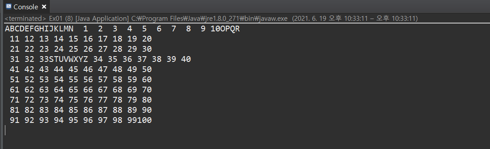

***
아래의 코드를 보면,
Runnable인터페이스는 오로지 run()만 정의되어 있는 간단한 인터페이스이다.
Runnable인터페이스를 구현하기 위해서 할 일은 추상메서드인 run() 의 몸통{}을
만들어 주는 것뿐이다.
~~~ javascript
package thread;

//Thread 
/*
 * 
 * 자바에서 Thread를 만드는 방법 2가지
 * 1. Thread를 상속 받아 정의
 * 
 * 2. Runnable 인터페이스 구현하여 Thread를 생성하는 방법
 * * Runnable 은 쓰레드의 인터페이스화 된 형태
 * 자바에서 다중상속이 불가능 함으로 다른 클래스를 상속 받은 클래스의 경우
 * implements 로 Runnable을 상속받아 쓰레드를 구현 할 수 있습니다. 
 * 
 * 
 * */
//1번 방법
class MyThread01 extends Thread {
	
	@Override
	public void run() {//새로운 스레드의 main함수와 같은 역할을 하는 메서드
		for (char i ='A'; i<='N'; i++) {
			System.out.print(i);
		}
		
		
	}
	
}

//2번 방법 
//내가 이미 하나의 다른 클래스를 상속받고있다면 쓰레드를 동시에 상속받을 수 없으니
// 인터페이스 Runnable를 상속받아 쓰레드구현 하는 방법이 있다.  
class A{}
class MyThread02 extends A implements Runnable {
	@Override
	public void run() {
		for (char i ='O'; i<='Z'; i++) {
			System.out.print(i);
			
		}
		
	} 
}
~~~

이 둘은 인스턴스 생성 방법의 차이를 아래 코드로 확인해보자.  
Runnable 인터페이스를 구현한 경우, Runnable인터페이스를 구현한 클래스의 인스턴스를
생성한 다음, 이 인스턴스를 Thread클래스의 생성자의 매개변수로 제공해야 한다.
~~~javascript
public class Ex01 {

	public static void main(String[] args) {
		MyThread01 mt01 = new MyThread01();
		
		// run을 호출(XXX) start사용
		
		//1번 방법. Thread 상속받아 사용
		mt01.start(); //위의 override한 run이 자동 실행 
		// A~N 출력
		
		
		//2번 방법. Runnable 인터페이스를 사용해서 스레드 생성
        MyThread02 r = new MyThread02();
		Thread th = new Thread(r);
		th.start();
		// N ~ Z 출력
		
		for (int i=1; i<=100; i++) {
			System.out.printf("%3d", i);
			if (i!=0 && i%10 ==0) {
				System.out.println();
				
			}
			
		}
		
	}
}

~~~

결과 
A~~Z 1~ 100 까지 순서대로 출력되지 않고 번갈아가며 쓰레드가 실행되는것을 볼 수 있다.

<U>조금 더 Runnable에 대해 알아보자.</U>
아래의 코드는 실제 Thread클래스의 소스코드(Thread.java)를 수정해 놓은 것인데 
~~~ javascript
public class Thread {
    private Runnable r;
    
    public Thread(Runnable r) {
        this.r=r;
    }
    public void run() {
        if (r!=null) {
            r.run(); //Runnable인터페잇를 구현한 인스턴스의 run()을 호출
        }
    }
}
~~~
run()을 호출하면 참조변수 r을 통해서 RUnnable인터페이스를 구현한 인스턴스의 run()이 호출된다. 
이렇게 함으로써 상속을 통해 run()을 오버라이딩하지 않고도
외부로부터 run()을 제공받을 수 있게 된다. 

또한, 
Thread클래스를 상속받으면, 자손 클래스에서 조상인 Thread클래스의 메서드를 
직접 호출할 수 있지만, 
Runnable을 구현하면 Thread클래스의 static메서드인 current Thread()를 호출하여 쓰레드에 대한 참조를 얻어 와야만 호출이 가능하다.
> static Thread currentThread() /현재 실행중인 쓰레드의 참조를 반환한다.
> String getName() //쓰레드의 이름을 반환한다. 

~~~ javascript
class MyThread01 extends Thread {
	@Override
	public void run() {//새로운 스레드의 main함수와 같은 역할을 하는 메서드
		for (int i=0; i<5; i++) {
			System.out.print(getName()); //조상 Thread의 getName()호출
		}
	}
}

class MyThread02 implements Runnable {
	@Override
	public void run() {
		for (int i=0; i<5; i++) {
		    // Thread.currentThread() - 현재 실행중인 Thread를 반환한다. 
			System.out.print(Thread.currentThread().getName());
			
		}
		
	} 
}
~~~

**[쓰레드 실행 - start()]**
쓰레드의 실행은 앞서 코드에서 봤듯이 start()를 호출하면 쓰레드가 실행된다.  
알아둘 팁은,
한 번 실행이 종료된 스레드는 다시 실행할 수 없다.
즉, 하나의 쓰레드에 대해 start()가 한 번만 호출될 수 있다는 뜻이다.
MyThread01 t1 = new MyThread01(); 
t1.start(); 
t1.start(); //예외발생  

다시 사용할 시에는 
t1.start(); 
t1 = new MyThread01(); //다시 생성 
t1.start(); 

 
