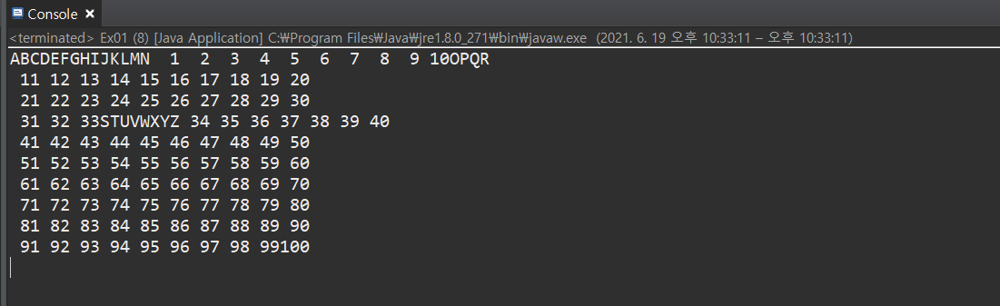

***
오늘은 정말 기초수업에 들었지만 기억은 하나도 나지 않았던 쓰레드 구현입니다. 
옛 기억을 살려가며 포스팅

~~~ javascript
package thread;

//Thread 
/*
 * 
 * 자바에서 Thread를 만드는 방법 2가지
 * 1. Thread를 상속 받아 정의
 * 
 * 2. Runnable 인터페이스 구현하여 Thread를 생성하는 방법
 * * Runnable 은 쓰레드의 인터페이스화 된 형태
 * 자바에서 다중상속이 불가능 함으로 다른 클래스를 상속 받은 클래스의 경우
 * implements 로 Runnable을 상속받아 쓰레드를 구현 할 수있습니다. 
 * 
 * 
 * */
//1번 방법
class MyThread01 extends Thread {
	
	@Override
	public void run() {//새로운 스레드의 main함수와 같은 역할을 하는 메서드
		for (char i ='A'; i<='N'; i++) {
			System.out.print(i);
		}
		
		
	}
	
}

//2번 방법 
//내가 이미 하나의 다른 클래스를 상속받고있다면 쓰레드를 동시에 상속받을 수 없으니
// 인터페이스 Runnable를 상속받아 쓰레드구현 하는 방법이 있다.  
class A{}
class MyThread02 extends A implements Runnable {
	@Override
	public void run() {
		for (char i ='O'; i<='Z'; i++) {
			System.out.print(i);
			
		}
		
	} 
}

//실행해보자
public class Ex01 {

	public static void main(String[] args) {
		MyThread01 mt01 = new MyThread01();
		
		
		// run을 호출(XXX) start사용
		
		//1번 방법. Thread 상속받아 사용
		mt01.start(); //위의 override한 run이 자동 실행 
		// A~N 출력
		
		
		//2번 방법. Runnable 인터페이스를 사용해서 스레드 생성
		Thread th = new Thread(new MyThread02());
		th.start();
		// N ~ Z 출력
		
		for (int i=1; i<=100; i++) {
			System.out.printf("%3d", i);
			if (i!=0 && i%10 ==0) {
				System.out.println();
				
			}
			
		}
		
	}
}

~~~
결과 
A~~Z 1~ 100 까지 순서대로 출력되지 않고 번갈아가며 쓰레드가 실행되는것을 볼 수 있습니다

 

 
